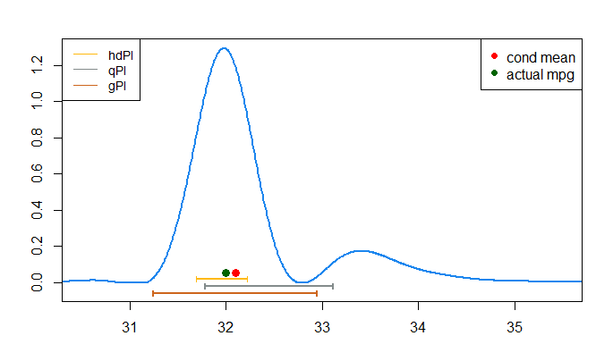
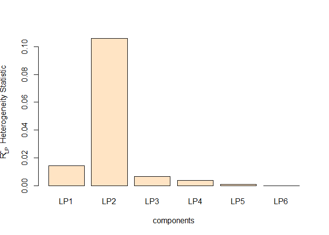
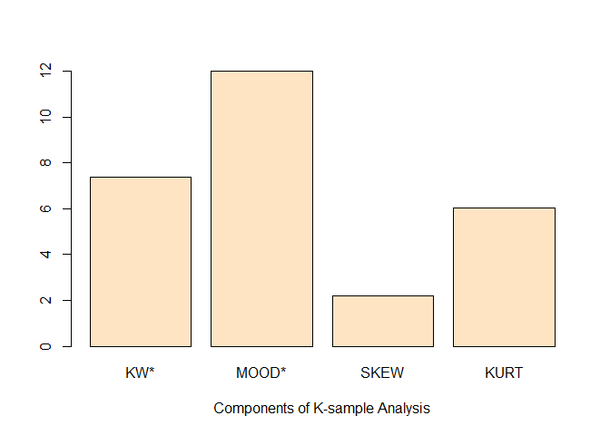

# LPMachineLearning <a href='https://github.com/LPML-hub/LPMachineLearning/'></a>

Main files for LPMachineLearning package. This is package provide
Statistical modeling tools for converting a black-box ML algorithm into
an interpretable conditional distribution prediction machine, which
provides a wide range of facilities, including goodness-of-fit, various
types of exploratory graphical diagnostics, generalized feature
selection, predictive inference methods, and others.

More details can be found in [R package
documentation](https://github.com/LPML-hub/LPMachineLearning/blob/master/LPMachineLearning-manual.pdf).


### Installation

Currently private repository, user can install it using the devtools:

``` r
library(devtools)
install_github("LPStat-Hub/LPMachineLearning",auth_token = 'b59b80e7308e43df6ed800597149c63748a3b9eb')
```

The package can be loaded using the command:

``` r
library(LPMachineLearning)
```

### Usage Examples

Once installed, the package provide tools for following tasks:

#### Pivot Uncertainty modeling

This example uses the Movie box-office revenue data (Voudouris et al.,
2012). The goal of this study is to build a forecasting model for film
revenue that predicts the distribution of Y given some X=x. In this
case, we use X=12 for demonstration.

``` r
#load data
data(boxOffice)
attach(boxOffice)
X.test<-12
fc <-  c("cornflowerblue", "lightseagreen")  
plot(x[x>9],y[x>9],cex=.8,col="gray70",ylab="After first week box office revenues",xlab="Opening day box office revenues",cex.lab=.9)
abline(v=X.test,col=fc,lty=2,lwd=2)
```

<!-- -->

Usually the user will provide a pivot as an initial “guess” of the
conditional distribution at x=12:

``` r
#pivot function
pivot=function(x){dnorm(x,14.47,sd(y))}
y.axe=seq(8,21,length.out=1000)
plot(y.axe, pivot(y.axe),col="lightsalmon1",type="l",ylab="Pivot Density",xlab="",lwd=2)
```

<!-- -->

This pivot will be used to compute contrast density:

``` r
X.test<-12
UPM.out<-UPM(x,y,X.test,m=c(2,6),method.ml='gbm',pivot=pivot)
```

``` r
#auxiliary function for plotting contrast density:
dhat.plot.norm<-function(LPcden.obj,df=15,mu.x0,sd.x0,col='steelblue'){
  y<-LPcden.obj$y
  for(plotid in 1:length(LPcden.obj$dhat)){
    
    dhat.obj<-LPcden.obj$dhat[[plotid]]
    u.axe<-seq(0.01,.99,length.out=1000)  
    y.axe<-qnorm(u.axe,mu.x0 ,sd.x0)    
    dvals<-dhat.obj(y.axe)
    delta0<-diff(range(dvals))
    par(mar=c(5,4.5,2,2))
    uaxe<-seq(0.01,.99,length.out=6)   
    zaxe<-qnorm(uaxe,mu.x0 ,sd.x0)    
    splineres<-smooth.spline(u.axe,dvals,df=df)
    
    y.acc<-floor(log10(max(splineres$y)))
    ymax<-round(max(splineres$y)/10^(y.acc))*10^(y.acc)
    
    plot(splineres$x,splineres$y,col=col,type='l',lwd=2,
         xlab='',ylab='',main='',cex.axis=.8, ylim=c(0,ymax),
         frame.plot=FALSE,xaxt='n')
    axis(side=1,at=uaxe,col='darkred',tcl=.3,line=1.1,labels=FALSE)
    axis(side=1,at=uaxe,col='gray0',tcl=-.3,line=1.25,labels=FALSE)
    text(uaxe, par("usr")[3] + 0.013*delta0, col='darkred',
         labels = seq(0,1,length.out=6), cex=.8, pos = 1, xpd = TRUE)
    text(uaxe, par("usr")[3] - 0.08*delta0, col='gray0',
         labels = round(zaxe,1), cex=.8, pos = 1, xpd = TRUE)
    mtext(expression(hat(d)),cex=1, side=2,line=2)
    mtext('u', side = 1, line = -.3, outer = FALSE, at = c(min(uaxe)-diff(range(uaxe))/20),col='darkred')
    mtext('y', side = 1, line = 1.2, outer = FALSE, at = c(min(uaxe)-diff(range(uaxe))/20),col='gray0')
  }
  
}
```

``` r
#contrast density plot
dhat.plot.norm(UPM.out,df=12,mu.x0=14.47,sd.x0=sd(y),col=fc[1])   
abline(h=1,lty=2,col='bisque3')
```

<!-- -->

Multiplying the pivot with this contrast density will lead us to the
conditional density at x=12:

``` r
#conditional distribution density
y.axe=seq(9,20,length.out=1000)
par(mar=c(5,4.5,2,2))
plot(y.axe,UPM.out$cond.den[[1]](y.axe),type="l",col=fc[1],lwd=2,
     xlab="y",ylab="",main="")
points(c(12.5,16.1),c(-.001,-.001),pch=17,col="indianred1",cex=1.2) 
```

<!-- -->

``` r
detach(boxOffice)   
```

#### d-sharpening

Here we show how we can provide sharpened samples compatible with the
underlying stochastic data generating mechanism using our contrast
density. We use the butterfly example in the reference paper for
demonstration and want to obtain sharpened samples at x=2. First, we
provide some sample points from the interval x between [0,4].

``` r
#load data
data(butterfly)
attach(butterfly)
X.test=2
#true density at x=2:
dtrue<-function(x){
  dnorm(x,mean=X.test)*.5+dnorm(x,mean=-X.test)*.5
}
#pivot samples
y.pivot<- y[x<4 & x>0]  
ygrid <- seq(-6,6,length=1000)
hist(y.pivot,col="grey95",20,prob=TRUE,ylim=c(0,.2),xlab="",main="")
box()
lines(ygrid,dtrue(ygrid),col='dodgerblue2',lwd=2)
```

<!-- -->

Using our `UPM()` function with argument `nsample=length(y.pivot)` will
generate the d-sharpened samples at x=2:

``` r
#generate d-sharp samples
set.seed(3302)
UPM.out<-UPM(x,y,X.test,ref.info=y.pivot,m=c(4,4),method.ml='knn',k=15,nsample=length(y.pivot))
y.sharp <- UPM.out$samples
```

``` r
#plotting the samples
hist(y.sharp,col="grey95",20,prob=TRUE,ylim=c(0,.21),xlab="",main="",xlim=c(-5.5,5.5))
box()
lines(ygrid,dtrue(ygrid),col='dodgerblue2',lwd=2)
```

<!-- -->

``` r
detach(butterfly)
```

#### Quantile Regression

`UPM()` also comes with a Quantile regression functionality. Here’s a
demonstration using Dutch Boys data:

``` r
#load data
data(dutch)
attach(dutch)
X.test <- as.matrix(c(seq(min(x),3,length=30), seq(3,max(x),length=70)))
#enable quantile regression by providing a set of target quantile values
UPM.out<-UPM(x,y,X.test,m=c(6,6),method.ml='glmnet',quantile.probs = c(.03,.15,.5,.85,.97))
Q.mat <- UPM.out$quantiles
```

``` r
#plotting the quantiles
par(mar=c(4,4,2,2))
plot(x,y,cex=.4,col="gray75",xlab="Age",ylab="BMI",cex.lab=1.15)
lines(smooth.spline(X.test,Q.mat[,1]), lty = 1, col = "dodgerblue2",lwd=1.5)
lines(smooth.spline(X.test,Q.mat[,2]), lty = 1, col = "forestgreen",lwd=1.5)
lines(smooth.spline(X.test,Q.mat[,3]), lty = 1, col = "red",lwd=1.5)
lines(smooth.spline(X.test,Q.mat[,4]), lty = 1, col = "mediumorchid2",lwd=1.5)
lines(smooth.spline(X.test,Q.mat[,5],df=25), lty = 1, col = "chocolate1",lwd=1.5)
legend("topleft",c(".97",".85",".50",".15",".03"),col=c("chocolate1", "mediumorchid2", "red","forestgreen","dodgerblue2"),lty=1,lwd=1.5,cex=.9)
```

<!-- -->

``` r
detach(dutch)
```

#### Goddness of Fit

This tool provides graphical diagnostics and test statistic to check
whether the models from UPM are congruent with the observed data.

``` r
#load data
data(butterfly)
attach(butterfly)
#compute the goodness of fit by picking a holdout set as test set.
n=length(y)
set.seed(129)
indx<- sample(1:n,floor(.15*n))
gof.knn<-UPM.gof(x,y,m=c(6,4),method="knn",k=15,indx=indx)
U.knn <- gof.knn$q.residuals
```

``` r
#plotting the goodness-of-fit results.
par(mfrow=c(1,2))
#histogram:
hist(U.knn,10,prob=TRUE,col="grey95",main='Histogram',xlab="U")
abline(h=1,col="blue",lty=2)
#QQ plot:
plot(sort(U.knn),ecdf(U.knn)(sort(U.knn)),xlab="U",ylab="",type="l",main='QQ plot')
points(sort(U.knn),ecdf(U.knn)(sort(U.knn)), col="dimgrey")
abline(0,1,col="blue",lwd=1.5,lty=2)
```

<!-- -->

``` r
detach(butterfly)
```

#### Prediction Interval

The `UPM()` function can also provide High Density Interval estimates on
the target conditional distribution based on generated samples. Here’s
an example using the Auto MPG data set, we are interested in the MPG for
1982 Dodge Rampage.

``` r
#load data
data("autompg")
X<-autompg[,-8]
y<-autompg[,8]
ind <- 390  #390 is the dodge rampage
X.test=X[ind,]
```

``` r
#The credMass argument indicates the target mass under curve for HD Interval
set.seed(1)
UPM.out<-UPM(X,y,X.test,m=c(4,6),method.ml='gbm',max_depth=10, credMass=.68,nsample=1000,quantile.probs=c(.16,.84))
```

``` r
#plotting
k=1
y.axe=seq(29.5,36.5,length.out=1000)
ss<-smooth.spline(y.axe,UPM.out$cond.den[[k]](y.axe),df=15)
yhat<-ss$y
yhat[yhat<0]<-0
plot(ss$x,yhat,type='l',col='dodgerblue2',lwd=2,
     xlab='',ylab='',main="",ylim=c(-.05,max(yhat)),xlim=c(30.5,35.5))
points(UPM.out$cond.mean[k],.05,pch=16,cex=1.25,col="red")
points(y[ind[k]],.05,pch=16,cex=1.25,col="darkgreen")
legend("topright",c("cond mean", "actual mpg"),pch=c(16,16),col=c("red","darkgreen"),cex=1)

#hdPI
hdin<-UPM.out$hdi.laser$hdi[[1]]
segments(hdin[, 1], 0.02, hdin[, 2], 0.02, lwd=2, col='darkgoldenrod1')
segments(hdin, rep(0.005,2), hdin, rep(0.035,2), lwd=1.5, col='darkgoldenrod1')

##qPI
Q.mat <- UPM.out$quantiles
segments(Q.mat[,1], -.02, Q.mat[,2], -.02, lwd=2, col='azure4')
segments(Q.mat, rep(-.035,2), Q.mat, rep(-0.005,2), lwd=2, col='azure4')

#gPI
s<-sd(UPM.out$samples)
mm<-mean(UPM.out$samples)

segments(mm-s, -0.06, mm+s, -0.06, lwd=2, col='chocolate3')
segments(c(mm-s,mm+s), rep(-.075,2), c(mm-s,mm+s), rep(-.045,2), lwd=2, col='chocolate3')
legend("topleft",c("hdPI","qPI","gPI"),col=c('darkgoldenrod1',"azure4",'chocolate3'),lty=1,lwd=1.5,cex=.9)
```

<!-- -->

#### Heterogeneity Component Analysis

This is an example given in section 3.1 of the reference paper, using
the Online news popularity data set.

``` r
#load data
data(onlineNews)
X<-onlineNews[,-60]
y<-onlineNews[,60]
```

``` r
#mean estimates using the GBM regression
library(h2o)
h2o.init()
h2o.no_progress()
reg.dat<-as.h2o(cbind(y,X))
modelfit<- h2o.gbm(y=1, training_frame = reg.dat) 
yhat <- as.matrix(predict(modelfit,reg.dat))
```

``` r
#heterogeneity analysis on residual series
HCA.result<-HCA(X,y-yhat,m=c(4,6),method.ml='glmnet')
```

``` r
#plotting
lp.stat <- HCA.result$dev.rate
bars<-matrix(lp.stat,nrow=1)
colnames(bars)<-paste0('LP',1:6)
barplot(bars,col="bisque",xlab='components',ylab=expression(R[LP]^2*"  Heterogeneity Statistic"),main="")  
```

<!-- -->

#### K-sample Problem

Our method also shares a connection with k-sample testing problem. Here
we use the LDL cholesterol data set, and want to know whether different
drug compounds change the LDL cholesterol levels. The hetergeneity
component analysis gives us direct answer:

``` r
#load data
data(cholesterol)
attach(cholesterol)
m=c(length(unique(x))-1,4)
#perform HCA
HCA.ldl<- HCA(x,y,m=m,method.ml='lm',alpha=NULL)
```

``` r
#plotting the statistics
lp.stat <- length(x)*HCA.ldl$dev.rate
bars<-matrix(lp.stat,nrow=1)
colnames(bars)<-c("KW*","MOOD*","SKEW","KURT")
barplot(bars,col="bisque",xlab='Components of K-sample Analysis',ylab="",main="",ylim=c(0,12)) 
```

<!-- -->

``` r
detach(cholesterol)
```

#### Generalized shape predictors

Generalized shape predictors are those that influence the whole
conditional distribution (beyond just mean) of the response Y. This
function finds the most relevant attributes that are predictive for
certain shapes (that user is interested in) of the conditional
distribution. Here’s an example using the online news popularity data:

``` r
#load data
library(glmnet)
data(onlineNews)
X<-onlineNews[,-60]
y<-onlineNews[,60]
```

``` r
#Lasso feature selection on each order: location, scale and skewness
coefmat<-matrix(0,3,ncol(X))
X<-as.matrix(X)
Tx<-LP.basis(X,m=1)
Ty<-as.matrix(LP.basis(y,m=3,Fmid=FALSE))
set.seed(51)
for(i in 1:3){
  opt.lasso <- cv.glmnet(Tx, Ty[,i], family="gaussian", type.measure="mse",nfolds=20)
  fit.lasso <- glmnet(Tx, Ty[,i], family="gaussian", lambda=opt.lasso$lambda.1se)
  coef0<-fit.lasso$beta
  coefmat[i,]<-as.numeric(coef0)
}
```

``` r
#plotting the top 10 coefficients
ind_sig<-order(colSums(coefmat^2),decreasing = TRUE)[1:10]
coefmat1<-t(abs(coefmat[,ind_sig]))
varnames<-colnames(X)[ind_sig]
rownames(coefmat1)<-varnames
colnames(coefmat1)<-c('location','scale','skewness')
pheatmap::pheatmap(coefmat1,color=blues9,cluster_cols = FALSE,cluster_rows = FALSE)
```

<!-- -->

#### Distributional Impact Function

This function deal with the “XYZ” problem where we observe covariates X,
response Y and a binary treatment Z. This function captures the
heterogeneous impact from the treatment Z on the response Y, as a
function of the covariate X.

Start with the Rosner’s FEV data set:

``` r
#load data
data(rosnerFEV)
attach(rosnerFEV)
```

`DIF()` computes the Distributional Impact Function values for each
`X.test`:

``` r
#computing DIF
DIF_out<-DIF(x,y,z,m=c(2,4),X.test=12:15,method='gbm')
```

The output also provides the “composition” of each DIF value, showing us
which component contributes the most to the final value:

``` r
#Components of DIF values
CIFcomp<-matrix(0,4,4)
for(i in 1:4){
  CIFcomp[i,]<-DIF_out$comp.DIF[i,]
}
colnames(CIFcomp)<-c('location','scale','skewness','tail')
```

``` r
#plotting the DIF values:
library(reshape2)
library(ggplot2)
databar<-as.data.frame(CIFcomp)
databar$age=paste0('Age=',12:15)
bar_df<-melt(databar,id='age')
ggplot(data=bar_df,aes(x=age, y=value, fill=variable))+
  geom_bar(stat="identity",position = position_stack(reverse = TRUE))+
  ylab('Distributional differences')+xlab('')+
  scale_fill_brewer(palette="Blues",direction=-1)+ #labs(fill = "Contribution:")+
  theme(text=element_text(size=13),
        panel.grid.major = element_blank(),
        panel.grid.minor = element_blank(),
        panel.background = element_blank(),
        axis.text.x = element_text(size=13),
        axis.text.y = element_text(size=14),
        axis.line = element_line(),
        legend.position="bottom",
        legend.title=element_blank())
```

<!-- -->

``` r
detach(rosnerFEV)
```


### References

Mukhopadhyay, S., and Wang, K. (2020) <b>Breiman’s ‘Two Cultures’
Revisited and Reconciled</b>. <i>Technical Report</i>.
